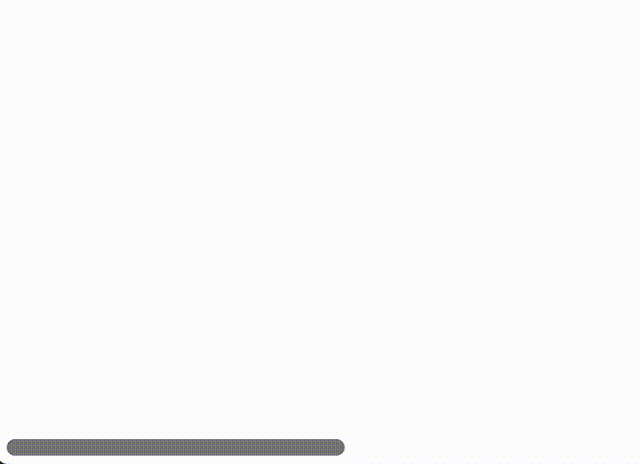

This tool is supposed to allow creating geometric constructions using straight edge and a compass.

The chain of thought leading to starting this project:

 1. See https://www.rafael-araujo.com/
 2. Want to create something similar for my new apt.
 3. The guy has years of experience. It will take me tons of paper and trial & error to get the right composition.
 4. Not unless I use a virtual tool instead of pen & paper.
 5. Fiddle with Geogebra for the task.
 6. That's lame, lets write our own.